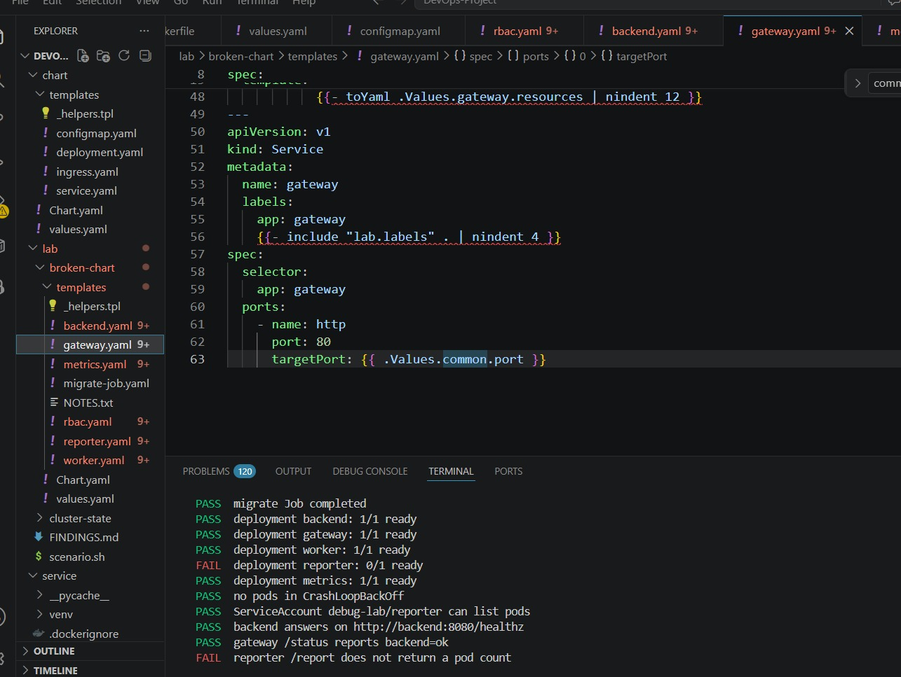
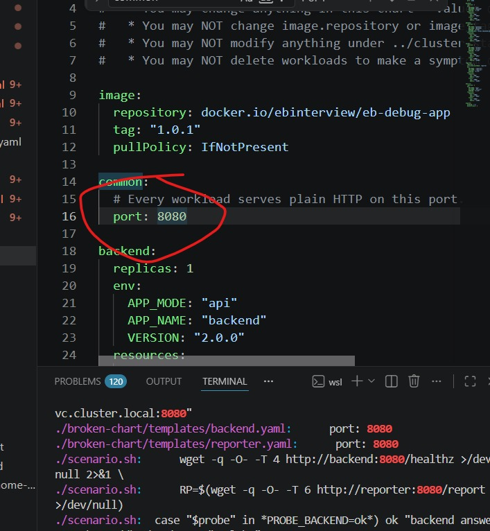
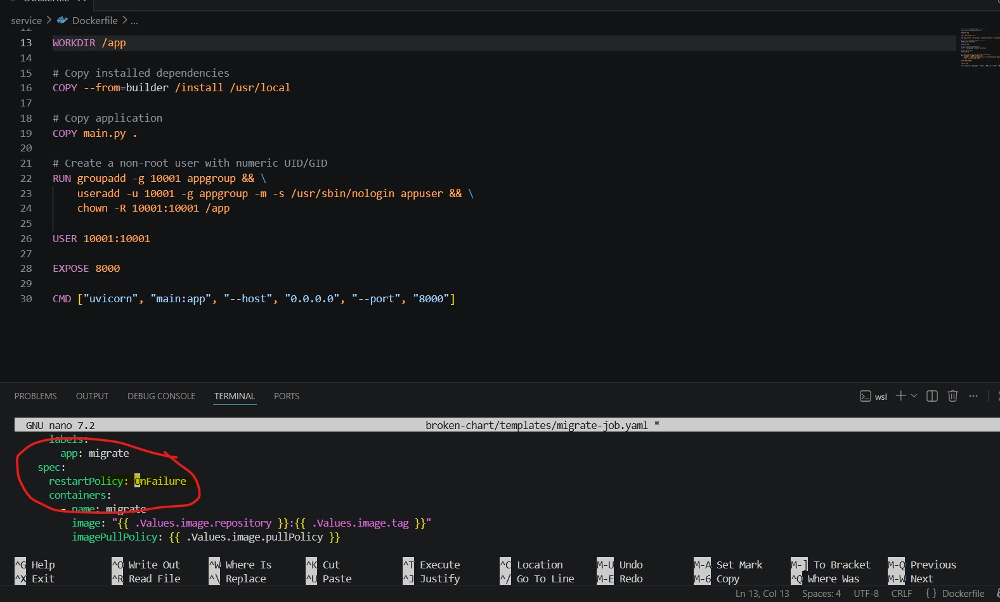
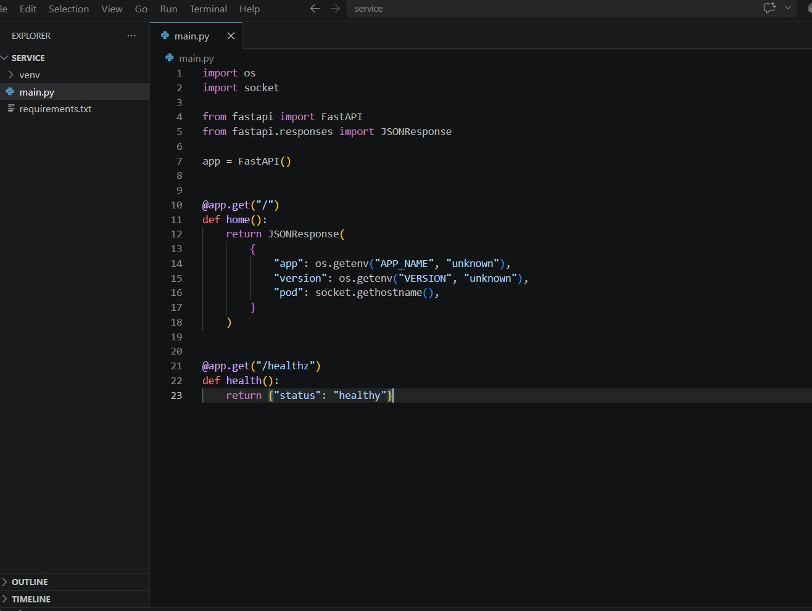
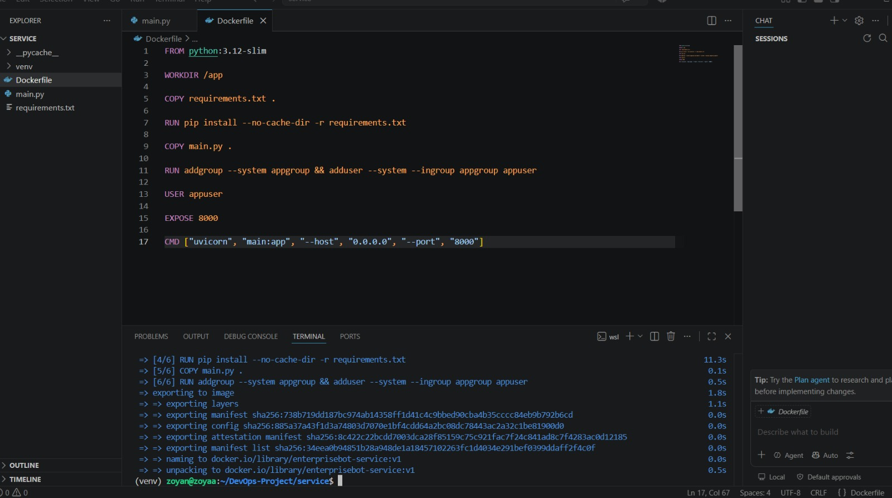
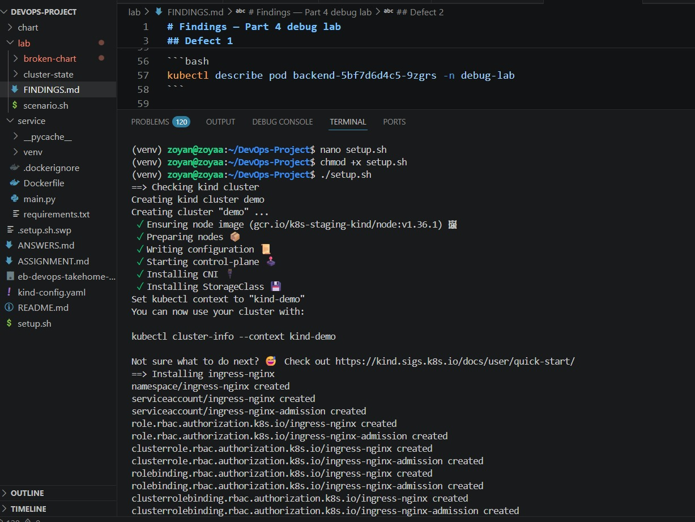

# DevOps / Platform Engineer Take-Home Assignment

## Overview

This repository contains the implementation for the DevOps / Platform Engineer take-home assignment.

The project includes:

* A containerized HTTP service
* A Helm chart deployment
* A one-command Kubernetes setup script
* A debugging exercise involving Kubernetes workloads, RBAC, probes, and service communication

---

# Repository Structure

```text
.
├── service/              # Application source code and Dockerfile
├── chart/                # Helm chart for application deployment
├── lab/                 # Kubernetes debugging lab
│   ├── broken-chart/    # Fixed Helm chart
│   ├── cluster-state/
│   ├── scenario.sh
│   └── FINDINGS.md
├── setup.sh             # Complete environment setup
├── ANSWERS.md           # Written assessment answer
└── README.md
```

---

# Running the Application

## Prerequisites

Required tools:

* Docker
* kubectl
* Helm
* kind

Verify:

```bash
docker --version
kubectl version --client
helm version
kind version
```

---

# Setup

The setup script creates the Kubernetes cluster, installs ingress-nginx, builds the image, loads it into kind, and deploys the Helm chart.

Run:

```bash
chmod +x setup.sh
./setup.sh
```

The script is designed to be idempotent and can be executed multiple times safely.

---

# Verify Deployment

Check pods:

```bash
kubectl get pods -n demo
```

Check services:

```bash
kubectl get svc -n demo
```

Verify the application:

```bash
kubectl port-forward svc/demo 8080:80 -n demo
```

Test:

```bash
curl http://localhost:8080/
```

Health check:

```bash
curl http://localhost:8080/healthz
```

---

# Helm Deployment

The Helm chart is located at:

```text
chart/
```

Features implemented:

* Configurable replica count
* Deployment resource requests and limits
* ConfigMap based application configuration
* Readiness and liveness probes
* Service exposure
* Ingress configuration for `demo.local`

---

# Resource Configuration

The application uses the following default resource configuration:

```yaml
resources:
  requests:
    cpu: 50m
    memory: 64Mi
  limits:
    cpu: 200m
    memory: 128Mi
```

Reasoning:

* The service is lightweight and primarily handles HTTP requests.
* Requests guarantee minimum scheduling resources.
* Limits prevent a faulty container from consuming excessive cluster resources.
* The values provide enough capacity for a small production-like workload while keeping local Kubernetes usage low.

---

# Debug Lab

The debugging exercise is available under:

```text
lab/
```

Run:

```bash
cd lab
./scenario.sh up
./scenario.sh verify
```

The investigation findings are documented in:

```text
lab/FINDINGS.md
```

---
---

# Evidence & Screenshots

The following screenshots provide practical evidence of the implementation, Kubernetes configuration, container security, application development, and debugging activities performed during this project.

## 1. Helm Gateway Service & Deployment Validation

This screenshot shows the Helm gateway Service configuration and deployment validation process. It demonstrates Kubernetes Service configuration, configurable ports, workload readiness checks, and service-to-service communication testing.

**Related files:**
- `lab/scenario.sh`
- `lab/broken-chart/templates/gateway.yaml`



---

## 2. Helm Values & Backend Configuration

This screenshot demonstrates Helm-based backend configuration, including the application port, application mode, application name, and version. It also shows configuration used while troubleshooting backend and reporter workload communication.

**Related files:**
- `chart/values.yaml`
- `lab/broken-chart/templates/backend.yaml`
- `lab/broken-chart/templates/reporter.yaml`



---

## 3. Container Security & Kubernetes Migration Job

This screenshot demonstrates container security hardening using a dedicated non-root user and the Kubernetes migration Job configuration with failure handling.

It provides evidence of:

- Non-root container execution
- Least-privilege container configuration
- Kubernetes Job configuration
- Failure handling with `restartPolicy: OnFailure`

**Related files:**
- `service/Dockerfile`
- `lab/broken-chart/templates/migrate-job.yaml`



---

## 4. FastAPI Application & Health Endpoint

This screenshot shows the FastAPI application implementation, including the application endpoint and Kubernetes-friendly `/healthz` health-check endpoint.

The application exposes runtime information such as the application name, version, and pod hostname, which helps validate the application after deployment.

**Related file:**
- `service/main.py`



---

## 5. Docker Image Build & Container Packaging

This screenshot demonstrates the Docker image build and container packaging process.

The Dockerfile packages the Python application, installs dependencies, configures the application environment, runs the application as a non-root user, and exposes the application port for Kubernetes deployment.

**Related file:**
- `service/Dockerfile`



---

## 6. Kind Kubernetes Cluster Setup

This screenshot demonstrates the creation and setup of the local Kubernetes environment using Kind.

It provides evidence of the project setup process, including Kubernetes cluster initialization and preparation of the environment for deploying and testing the application.

**Related files:**
- `setup.sh`
- `kind-config.yaml`



---

## Evidence Summary

These screenshots complement the source code, Helm charts, Kubernetes manifests, and setup scripts contained in this repository.

Together, they provide practical evidence of:

- Docker containerization
- Container security hardening
- FastAPI application development
- Helm-based Kubernetes deployment
- Kubernetes cluster provisioning with Kind
- Kubernetes health checks
- Service configuration
- Kubernetes debugging and troubleshooting
- Deployment validation

# Deliberately Skipped Items

## Full Production Monitoring Stack

A complete monitoring stack using Prometheus, Grafana, and centralized logging was not added.

Risk:

Without monitoring, production teams may have limited visibility into application failures, latency issues, and resource problems.

---

## Automated Deployment Pipeline

A full CI/CD pipeline was not implemented.

Risk:

Without automated testing, image scanning, and deployment validation, configuration mistakes can reach production.

---

# Production Improvements

For a production environment I would add:

* CI/CD pipeline with automated testing
* Container vulnerability scanning using tools like Trivy
* Image signing and verification
* External secret management
* NetworkPolicies between services
* PodDisruptionBudgets
* Horizontal Pod Autoscaling
* Centralized logging and monitoring
* GitOps deployment using ArgoCD or Flux
* Backup and disaster recovery strategy

---

# How I Used AI

I used AI assistants (ChatGPT and Claude) as productivity tools during this assignment.

AI was used for:

* Reviewing Kubernetes and Helm troubleshooting approaches
* Improving documentation structure
* Reviewing possible root causes during debugging
* Generating initial documentation drafts

I validated all generated suggestions manually, tested commands against my local Kubernetes environment, and corrected outputs based on actual cluster behaviour.

The final implementation decisions, debugging steps, and fixes were verified by me.

---

# Author
Tehseen Nayeem Khan

DevOps Engineer Candidate
